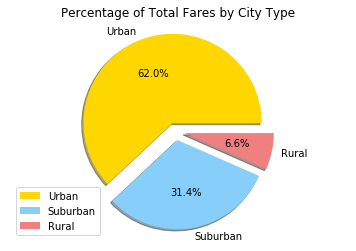
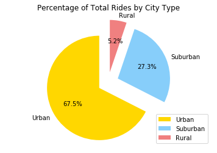
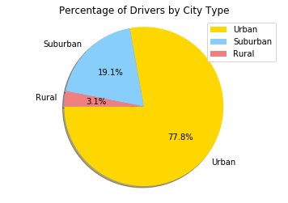

# Pyber: Ride Sharing Analysis


```python
import os
import pandas as pd
import numpy as np
import matplotlib.pyplot as plt
```


```python
CityData = os.path.join('05-Matplotlib', 'Instructions', 'Pyber', 'raw_data','city_data.csv')
RideData = os.path.join('05-Matplotlib', 'Instructions', 'Pyber', 'raw_data','ride_data.csv')
city_df = pd.read_csv(CityData)
ride_df = pd.read_csv(RideData)
pyber_df = pd.merge(city_df, ride_df, on='city', how='left')
pyber_df.shape
```


    (2407, 6)


```python
pyber_df.head()
```


<div>
<style>
    .dataframe thead tr:only-child th {
        text-align: right;
    }

    .dataframe thead th {
        text-align: left;
    }

    .dataframe tbody tr th {
        vertical-align: top;
    }
</style>
<table border="1" class="dataframe">
  <thead>
    <tr style="text-align: right;">
      <th></th>
      <th>city</th>
      <th>driver_count</th>
      <th>type</th>
      <th>date</th>
      <th>fare</th>
      <th>ride_id</th>
    </tr>
  </thead>
  <tbody>
    <tr>
      <th>0</th>
      <td>Kelseyland</td>
      <td>63</td>
      <td>Urban</td>
      <td>2016-08-19 04:27:52</td>
      <td>5.51</td>
      <td>6246006544795</td>
    </tr>
    <tr>
      <th>1</th>
      <td>Kelseyland</td>
      <td>63</td>
      <td>Urban</td>
      <td>2016-04-17 06:59:50</td>
      <td>5.54</td>
      <td>7466473222333</td>
    </tr>
    <tr>
      <th>2</th>
      <td>Kelseyland</td>
      <td>63</td>
      <td>Urban</td>
      <td>2016-05-04 15:06:07</td>
      <td>30.54</td>
      <td>2140501382736</td>
    </tr>
    <tr>
      <th>3</th>
      <td>Kelseyland</td>
      <td>63</td>
      <td>Urban</td>
      <td>2016-01-25 20:44:56</td>
      <td>12.08</td>
      <td>1896987891309</td>
    </tr>
    <tr>
      <th>4</th>
      <td>Kelseyland</td>
      <td>63</td>
      <td>Urban</td>
      <td>2016-08-09 18:19:47</td>
      <td>17.91</td>
      <td>8784212854829</td>
    </tr>
  </tbody>
</table>
</div>


```python
mean_fare = pyber_df.groupby(['city'])['fare'].mean()
total_rides = pyber_df.groupby(['city'])['ride_id'].count()
total_drivers_df = city_df[['driver_count']]
total_drivers = city_df[['driver_count']].sum()
total_fares = pyber_df[('fare')].sum()
total_rides = pyber_df[('ride_id')].count()
rural_cites = pyber_df[(pyber_df.type == 'Rural')]
rural_cites_df = pd.DataFrame(pyber_df[(pyber_df.type == 'Rural')])
total_rural_fares = rural_cites_df[('fare')].sum()
perc_total_fares_rural = total_rural_fares / total_fares
suburban_cites_df = pd.DataFrame(pyber_df[(pyber_df.type == 'Suburban')])
urban_cites_df = pd.DataFrame(pyber_df[(pyber_df.type == 'Urban')])
total_suburban_fares = suburban_cites_df[('fare')].sum()
total_urban_fares = urban_cites_df[('fare')].sum()
total_rural_rides = rural_cites_df[('ride_id')].count()
total_suburban_rides = suburban_cites_df[('ride_id')].count()
total_urban_rides = urban_cites_df[('ride_id')].count()
perc_total_fares_urban = total_urban_fares / total_fares
perc_total_fares_suburban = total_suburban_fares / total_fares
perc_total_rides_rural = total_rural_rides / total_rides
perc_total_rides_urban = total_urban_rides / total_rides
perc_total_rides_suburban = total_suburban_rides / total_rides
rural_city_drivers_df = pd.DataFrame(city_df[(city_df.type == 'Rural')])
total_rural_drivers = rural_city_drivers_df[('driver_count')].sum()
perc_total_drivers_rural = total_rural_drivers / total_drivers
suburban_city_drivers_df = pd.DataFrame(city_df[(city_df.type == 'Suburban')])
total_suburban_drivers = suburban_city_drivers_df[('driver_count')].sum()
perc_total_drivers_suburban = total_suburban_drivers / total_drivers
urban_city_drivers_df = pd.DataFrame(city_df[(city_df.type == 'Urban')])
total_urban_drivers = urban_city_drivers_df[('driver_count')].sum()
perc_total_drivers_urban = total_urban_drivers / total_drivers
```


```python
x = mean_fare
y = total_rides
z = total_drivers_df
 
plt.scatter(x, y, s=z*3, alpha=0.5)
plt.title('Pyber Data')
plt.xlabel('Total Rides by City')
plt.ylabel('Mean Fare by City')
plt.show()
```


    ---------------------------------------------------------------------------

    ValueError                                Traceback (most recent call last)

    <ipython-input-84-c508d4dcce92> in <module>()
          3 z = total_drivers_df
          4 
    ----> 5 plt.scatter(x, y, s=z*3, alpha=0.5)
          6 plt.title('Pyber Data')
          7 plt.xlabel('Total Rides by City')


    ~/anaconda3/envs/PythonData/lib/python3.6/site-packages/matplotlib/pyplot.py in scatter(x, y, s, c, marker, cmap, norm, vmin, vmax, alpha, linewidths, verts, edgecolors, hold, data, **kwargs)
       3355                          vmin=vmin, vmax=vmax, alpha=alpha,
       3356                          linewidths=linewidths, verts=verts,
    -> 3357                          edgecolors=edgecolors, data=data, **kwargs)
       3358     finally:
       3359         ax._hold = washold


    ~/anaconda3/envs/PythonData/lib/python3.6/site-packages/matplotlib/__init__.py in inner(ax, *args, **kwargs)
       1708                     warnings.warn(msg % (label_namer, func.__name__),
       1709                                   RuntimeWarning, stacklevel=2)
    -> 1710             return func(ax, *args, **kwargs)
       1711         pre_doc = inner.__doc__
       1712         if pre_doc is None:


    ~/anaconda3/envs/PythonData/lib/python3.6/site-packages/matplotlib/axes/_axes.py in scatter(self, x, y, s, c, marker, cmap, norm, vmin, vmax, alpha, linewidths, verts, edgecolors, **kwargs)
       4017         y = np.ma.ravel(y)
       4018         if x.size != y.size:
    -> 4019             raise ValueError("x and y must be the same size")
       4020 
       4021         if s is None:


    ValueError: x and y must be the same size


```python
labels = ['Urban', 'Suburban', 'Rural']
sizes = [perc_total_fares_urban, perc_total_fares_suburban, perc_total_fares_rural]
colors = ['gold','lightskyblue','lightcoral']

explode = [0.1,0.1,0.1]
plt.pie(sizes, explode=explode, labels=labels, colors=colors,
       autopct="%1.1f%%",shadow=True, startangle=0)
plt.legend(labels, loc="lower left")
plt.title('Percentage of Total Fares by City Type')
plt.axis("equal")
plt.show()
```





```python
labels = ['Urban', 'Suburban', 'Rural']
sizes = [perc_total_rides_urban, perc_total_rides_suburban, perc_total_rides_rural]
colors = ['gold','lightskyblue','lightcoral']

explode = [0.2,0.2,0.2]
plt.pie(sizes, explode=explode, labels=labels, colors=colors,
       autopct="%1.1f%%",shadow=False, startangle=90)
plt.title('Percentage of Total Rides by City Type')
plt.legend(labels, loc="best")
plt.axis("equal")
plt.show()
```





```python
labels = ['Urban', 'Suburban', 'Rural']
sizes = [perc_total_drivers_urban, perc_total_drivers_suburban, perc_total_drivers_rural]
colors = ['gold','lightskyblue','lightcoral']

explode = [0,0,0]
plt.pie(sizes, explode=explode, labels=labels, colors=colors,
       autopct="%1.1f%%",shadow=True, startangle=180)
plt.title('Percentage of Drivers by City Type')
plt.legend(labels, loc="upper right")
plt.axis("equal")
plt.show()
```




